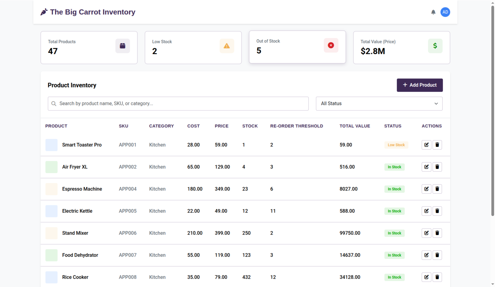

# Inventory Management System

A comprehensive web-based inventory management application built with Google Apps Script, HTML, CSS, and JavaScript. This system provides a user-friendly interface for managing product inventory with features like product CRUD operations, search, filtering, and real-time dashboard statistics.

## Features

### Dashboard Overview

* Total products count
* Low stock alerts
* Out of stock notifications
* Total inventory value (calculated from price and stock)

[Inventory System | Live Demo](https://tinyurl.com/erftubeBigCarrotInventory)



### Product Management

* Add Products: Create new inventory items with full product details
* Edit Products: Update product information (excluding SKU for safety)
* Delete Products: Remove products with confirmation dialog
* Search & Filter: Find products by name, SKU, or category
* Status Filtering: View products by stock status (In Stock, Low Stock, Out of Stock)

### User Interface

* Modern, responsive design with Bootstrap 5
* Dark purple theme with professional styling
* Pagination for large product lists
* Interactive modals for all operations
* Real-time success/error feedback

## Technologies Used

**Frontend**

* HTML5 - Semantic markup structure
* CSS3 - Custom styling with CSS variables
* Bootstrap 5.3.2 - Responsive framework and components
* Font Awesome 6.4.0 - Icons and visual elements
* Vanilla JavaScript - Client-side functionality

**Backend**

* Google Apps Script - Server-side logic
* Google Sheets - Data storage (Products sheet)

## Architecture

### File Structure

```
├── Code.js                    # Main entry point (doGet function)
├── product_crud.gs           # Product CRUD operations
│   ├── addProduct(product)   # Create new products
│   ├── deleteProductBySku(sku) # Delete products by SKU
│   └── updateProductBySku(sku, updates) # Update existing products
├── dashboard_stats.gs        # Dashboard statistics calculation
│   └── getDashboardStats()   # Get inventory overview data
└── main.html                 # Frontend interface
```

### Google Apps Script Functions

**Product CRUD Operations**

* `addProduct(product)` - Adds a new product with validation and duplicate SKU prevention
* `deleteProductBySku(sku)` - Safely deletes products by SKU
* `updateProductBySku(sku, updates)` - Updates product details (SKU cannot be changed)

**Dashboard Statistics**

* `getDashboardStats()` - Calculates total products, low stock count, out of stock count, and total inventory value

## Setup Instructions

1. **Create Google Apps Script Project**

   * Go to Google Apps Script
   * Create a new project
   * Set up your Google Sheet with a "Products" sheet containing the following columns:
     `SKU`, `Product`, `Category`, `Cost`, `Price`, `Stock`, `Reorder_Threshold`

2. **Add Files to Your Project**

   * `Code.js`

   ```javascript
   function doGet() {
     return HtmlService.createHtmlOutputFromFile("main");
   }
   ```

   * `product_crud.gs` (contains addProduct, deleteProductBySku, updateProductBySku functions)
   * `dashboard_stats.gs` (contains getDashboardStats function)
   * `main.html` (the complete frontend interface)

3. **Configure Google Sheet**

   * Ensure your Google Sheet has a sheet named "Products"
   * Proper column headers in the first row
   * At least one row of example data (optional)

4. **Deploy**

   * In Google Apps Script, click "Deploy" > "New deployment"
   * Set the deployment type to "Web app"
   * Choose who has access
   * Click "Deploy"

## Usage

**Dashboard Overview**

* View key inventory metrics at a glance
* Monitor stock levels and values
* Track low stock and out of stock items

**Adding Products**

* Click "Add Product" button
* Fill in product details in the modal (Required fields: Product Name, SKU, Category)
* Click "Save Product" to add to inventory

**Editing Products**

* Click the edit button next to any product
* Modify the product information (SKU field is hidden to prevent accidental changes)
* Click "Update Product" to save changes

**Deleting Products**

* Click the delete button next to any product
* Confirm deletion in the dialog
* Product is removed from both Google Sheet and UI

**Searching and Filtering**

* Use the search bar to find products by name, SKU, or category
* Filter by status: All Status, In Stock, Low Stock, Out of Stock
* Results update in real-time with pagination

## Data Structure

**Product Object**

```json
{
  "sku": "WH-001",
  "product": "Wireless Headphones",
  "category": "Electronics",
  "cost": 45.00,
  "price": 129.99,
  "stock": 45,
  "reorder_threshold": 10
}
```

**Dashboard Response**

```json
{
  "total": 150,
  "low": 12,
  "out": 5,
  "cost": 25000.00,
  "price": 45000.00,
  "items": [...]
}
```

## Security Features

* SKU Protection: SKU cannot be changed during edit operations
* Duplicate Prevention: System prevents adding products with duplicate SKUs
* Input Validation: Required field validation on all operations
* Confirmation Dialogs: Delete operations require explicit confirmation

## Browser Compatibility

* Chrome (recommended)
* Firefox
* Safari
* Edge

## License

This project is open source and available under the MIT License.
